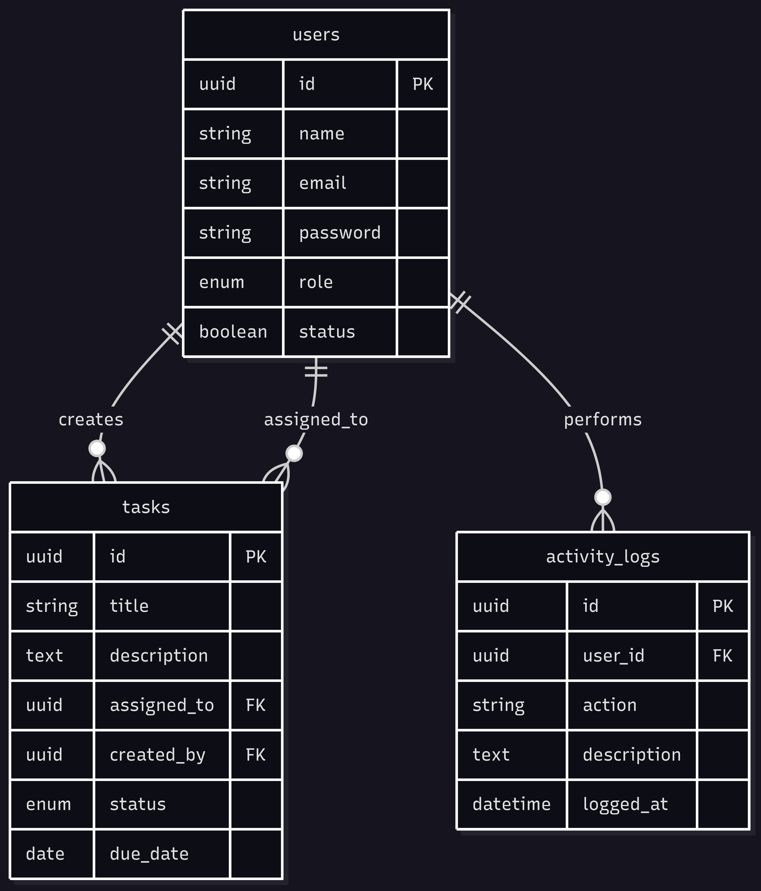
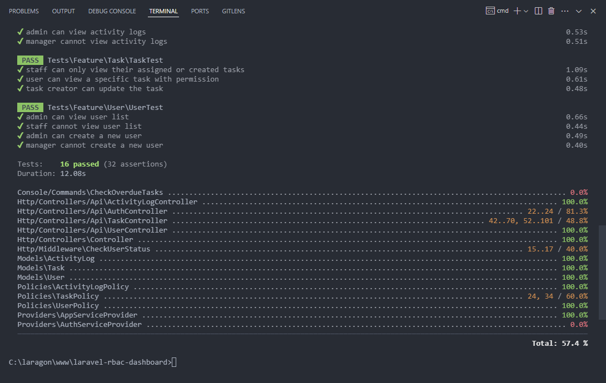
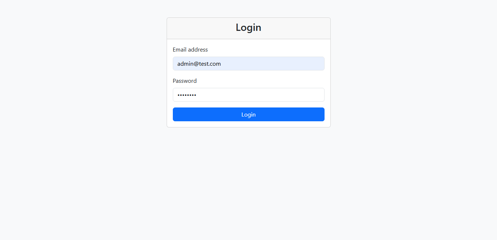
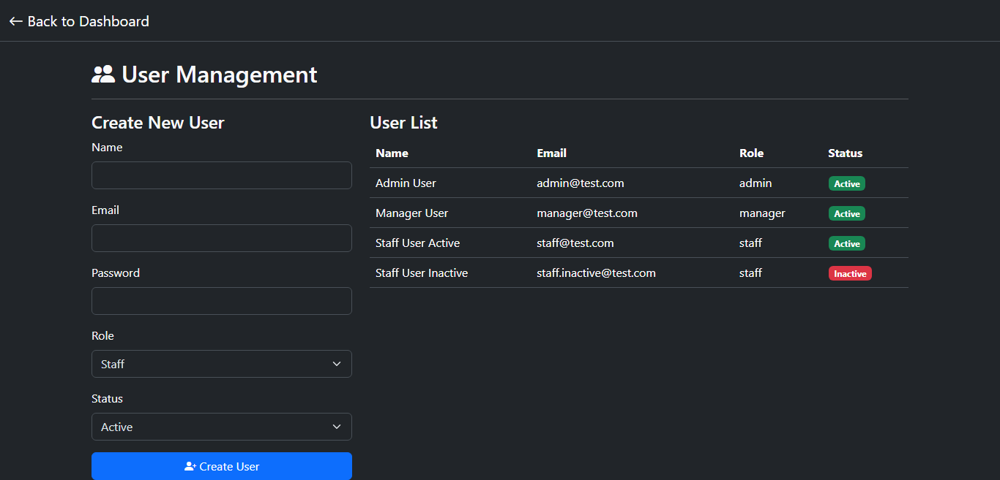
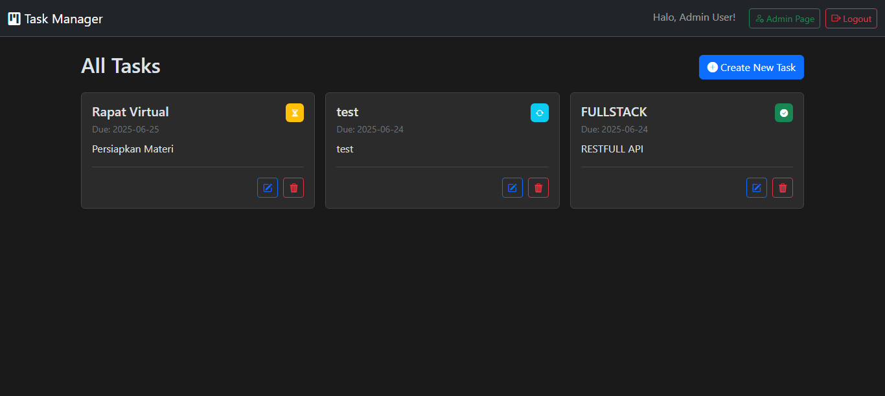

# Laravel RBAC Dashboard API & Frontend

Sebuah proyek RESTful API berbasis **Laravel 12** dengan implementasi **Role-Based Access Control (RBAC)** dan frontend sederhana menggunakan **Vanilla JS** + **Bootstrap**.

---

## 📦 Tech Stack

- Laravel 12
- Sanctum (Authentication)
- MySQL
- Bootstrap 5
- Vanilla JavaScript (Fetch API)
- Laravel Scheduler & Policy
- PHPUnit (Testing)

---

## 🛠️ Setup Project

```bash
git clone https://github.com/DiandraFrza/laravel-rbac-dashboard.git
```
```bash
cd laravel-rbac-dashboard
```
```bash
composer install
```
```bash
cp .env.example .env
```
```bash
php artisan key:generate
```

# Konfigurasi .env (DB, Mail, dll)
```bash
php artisan migrate --seed
```
```bash
php artisan serve
```

(Opsional): Jalankan scheduler
```bash
php artisan schedule:work
```

---

## 🗂️ Struktur Folder
```text
├── app/
│   ├── Http/
│   ├── Models/
│   ├── Policies/
│   ├── Services/
│   ├── Console/Commands/CheckOverdueTasks.php
├── routes/api.php
├── public/frontend/index.html
├── tests/
│   ├── Feature/
│   └── Unit/
├── .env.example
├── README.md
```

---

## 🧠 ERD (Entity Relationship Diagram)



---

## 

| Role    | View Users | Manage Tasks | Assign Tasks | View Logs |
| ------- | ---------- | ------------ | ------------ | --------- |
| Admin   | ✅          | ✅            | ✅            | ✅         |
| Manager | ✅          | ✅ | ✅  | ❌         |
| Staff   | ❌          | ✅    | ❌            | ❌         |

---

## ⚙️ Fitur

✅ Authentication
- Laravel Sanctum login
- Middleware: auth:sanctum, checkUserStatus
- User inactive tidak bisa login
 
✅ User Management (Admin only)
- Create user
- List user
- Set status active/inactive

✅ Task Management
- Role-based task visibility
- Admin/Manager create & assign tasks
- Task status: pending, in_progress, done
- Filter by assigned user
- Auto-log overdue task via scheduler

✅ Activity Logs
- Log semua aksi: create_user, update_task, etc.
- Bisa diakses hanya oleh admin

✅ Dashboard Frontend (Vanilla JS)
- Login Page
- Task Dashboard berdasarkan role
- Admin Page (create user, lihat user aktif)
- Form validation
- AJAX (fetch API)

--- 

## 🧪 Testing

```bash
php artisan test --coverage
```



--- 
## 📸 Screenshots

| Login Page                 | Dashboard                      | Create Task                      |
| -------------------------- | ------------------------------ | -------------------------------- |
|  |  |  |

---

## 🧾 .env Example
```text
APP_NAME="RBAC Dashboard"
APP_ENV=local
APP_KEY=base64:...
DB_CONNECTION=mysql
DB_HOST=127.0.0.1
DB_PORT=3306
DB_DATABASE=rbac_dashboard
DB_USERNAME=root
DB_PASSWORD=
```

